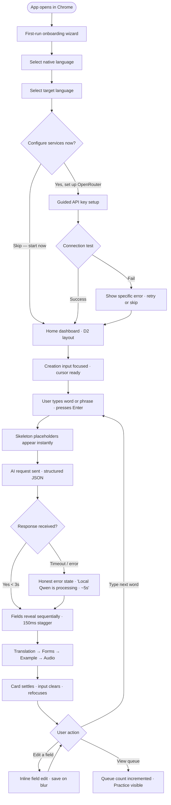
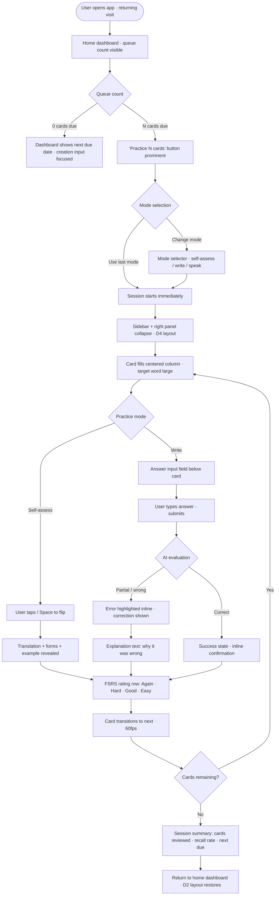
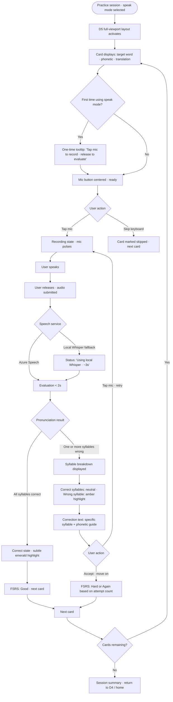
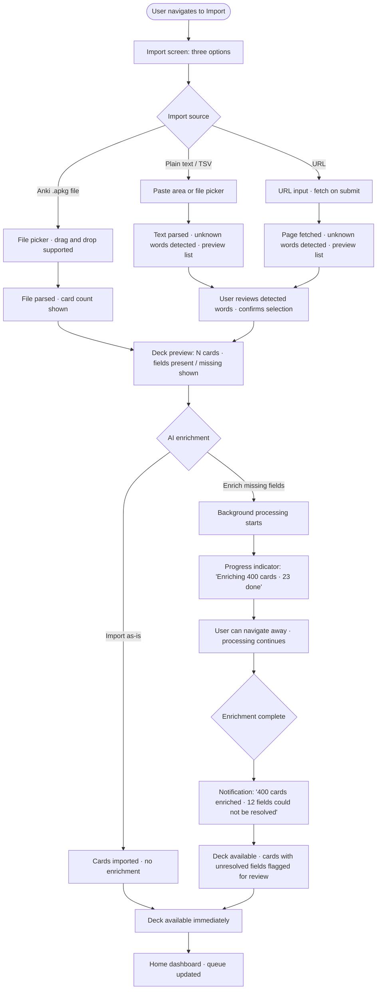
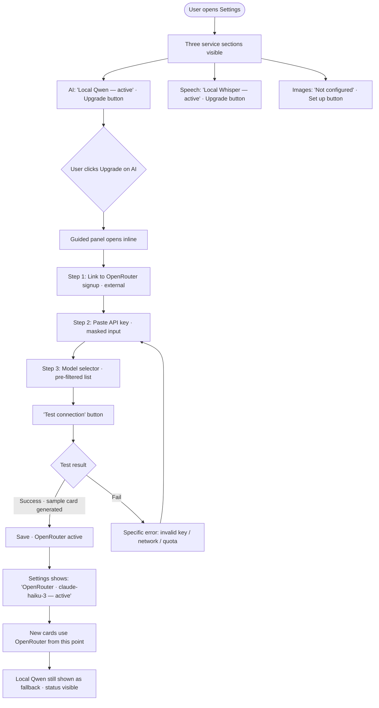

# UX Design Specification lingosips

**Author:** Oleksii
**Date:** 2026-04-26

---

<!-- UX design content will be appended sequentially through collaborative workflow steps -->

## Executive Summary

### Project Vision

Lingosips is a local-first language learning application that eliminates the cold-start friction of vocabulary study. Cloud AI (OpenRouter, Azure Speech) delivers the primary experience; local models (Qwen, Whisper) guarantee a complete, working product without any configuration. The defining design commitment: AI is authoritative — users never need to verify or correct generated content.

### Target Users

- **Self-Directed Learner:** Frustrated by Anki's card-creation overhead and Duolingo's shallowness. Wants AI to fill everything instantly.
- **Vocabulary Capturer:** Lives in real-time moments (films, articles). Needs sub-30-second capture without breaking flow.
- **Speak-Mode Practitioner:** Wants granular pronunciation feedback, not binary right/wrong.
- **Importer:** Has existing Anki decks or reading material. Wants AI enrichment on their prior investment.
- **Configurator:** Technical user who brings their own API keys. Wants control without requiring it.

### Key Design Challenges

1. **Progressive complexity** — Zero-config onboarding and deep configurator settings must coexist without either path feeling compromised.
2. **Multi-mode practice flow** — Three interaction patterns (self-assess, write, speak) in one session, all at 60fps with inline AI feedback.
3. **AI streaming UX** — Token-by-token generation and sub-2s pronunciation feedback must feel alive, not like loading states.
4. **Import enrichment trust** — Batch AI enrichment of large existing decks requires smart preview/sampling UX to build confidence without card-by-card review.

### Design Opportunities

1. **Card creation as signature delight** — Streaming word-to-full-card in <3s is the core "wow." Field-by-field token streaming could become a recognizable brand interaction.
2. **CEFR profile as motivational anchor** — Explanatory CEFR intelligence ("here's exactly what separates you from B2") is a unique differentiator with high emotional engagement potential.
3. **Speak mode visualization** — Per-syllable pronunciation feedback is rare. Visual syllable-highlighting or waveform annotation could be the app's most shareable feature.

## Core User Experience

### Defining Experience

The defining experience of lingosips is **frictionless vocabulary ownership** — type a word or phrase, receive a complete, authoritative card in under 3 seconds, and never think about scheduling. The two equal pillars of daily use are card creation (capture the moment) and practice sessions (FSRS-driven queue). On returning visits, the app opens to the review queue; on first launch, it opens to card creation after onboarding.

### Platform Strategy

- **Runtime:** Python backend (local server) + SPA frontend served to Chrome
- **Primary surface:** Desktop Chrome (mouse + keyboard)
- **Secondary surface:** Mobile browser on same local network — full functional support for practice sessions and vocabulary capture; optimized for touch
- **Storage:** SQLite managed by Python backend — no browser storage dependency
- **Local AI:** Python handles Qwen and Whisper directly — no separate user-managed inference server required
- **Offline:** Full functionality when Python server is running; cloud features (OpenRouter, Azure Speech) degrade gracefully without internet
- **Onboarding:** Entirely within the web application — no README-driven setup; first-run wizard handles language selection and optional service configuration

### Effortless Interactions

- **Word → full card:** Single input field, AI fills translation, gender, conjugation, audio, examples — zero additional user action required
- **Practice session start:** One tap/click from home — FSRS queue is pre-calculated, no mode selection required to begin
- **Speak mode:** Tap to record, release to evaluate — no microphone permission ritual per session
- **Import enrichment:** Paste or upload → AI enriches in background — user never babysits the process
- **FSRS scheduling:** Completely invisible — surfaces the right cards automatically, user never manually sets intervals

### Critical Success Moments

- **First card created:** Must happen within 60 seconds of first app launch, before any service configuration
- **First "this is better than Anki" moment:** When the user sees gender, conjugation, and audio appear automatically — no manual lookup
- **First speak mode feedback:** When pronunciation feedback names the specific syllable — not just "wrong"
- **Day 30 return:** FSRS surfaces exactly the right cards — user trusts the system and stops second-guessing it
- **Import completion:** 400 Anki cards enriched in background — user sees their existing investment upgraded without effort

### Experience Principles

1. **AI is authoritative, not assistive** — the system fills everything; users edit by exception, not by default
2. **Zero configuration to first value** — the app is fully functional before any API key is entered; onboarding nudges but never blocks
3. **Capture before it fades** — vocabulary capture must be under 30 seconds from thought to saved card, on any device
4. **Feedback that teaches, not judges** — all AI feedback (write mode, speak mode) explains the error specifically; no red marks without context
5. **Invisible scheduling** — FSRS works silently; the user's only job is to show up and practice

## Desired Emotional Response

### Primary Emotional Goals

- **Calm competence** — the dominant feeling; lingosips is a focused tool, not an entertainment product. Like a well-configured code editor: quiet, reliable, gets out of the way.
- **Genuine satisfaction** — earned, not manufactured. The satisfaction of a word actually sticking, a pronunciation improving, a CEFR level moving. No streaks, no confetti, no fake achievements.
- **Trust** — the user believes the AI-generated content is correct and the FSRS scheduling is right. Trust is the foundation every other emotion depends on.

### Emotional Journey Mapping

- **First launch:** Curiosity → immediate relief ("no account, no friction, I can just start")
- **First card created:** Surprise → delight ("it filled everything automatically")
- **First practice session:** Focused engagement — the rhythm of cards should feel like a quiet conversation with the material, not a test
- **Error / slow moment:** Honest acknowledgment — "Azure Speech is taking longer than usual, using local Whisper" — transparency over false smoothness
- **Day 30 return:** Quiet confidence — FSRS surfaces exactly what's due; the user trusts the system and doesn't second-guess it
- **Speak mode feedback:** The specific "a-gua-CA-te not A-gua-cate" moment — not judgment, but the feeling of having a patient tutor

### Micro-Emotions

- **Confidence over confusion** — every UI state is legible; user always knows what's happening and what to do next
- **Satisfaction over excitement** — muted success states (card learned, session complete) that feel earned, not hyped
- **Trust over skepticism** — AI content must be visibly high-quality; any field the user has to correct damages the core emotional promise
- **Flow over friction** — practice session transitions are invisible; no decision fatigue between cards

### Design Implications

- **Calm** → Restrained visual design; no animations that demand attention; typography-forward; generous whitespace; no notification badges or streak counters
- **Satisfaction** → Subtle, considered feedback moments — a card "settling" into the deck, a session summary that shows real progress metrics (not stars)
- **Honest error handling** → When AI is slow, a specific message ("Connecting to OpenRouter..."); when it fails, a specific fallback message ("Using local Qwen — response may take up to 5 seconds"); never a generic spinner that disappears
- **Trust** → AI-generated fields should look polished and authoritative; streaming tokens should feel intentional, not glitchy; pronunciation feedback must be specific enough to act on or it destroys trust

### Emotional Design Principles

1. **Earn satisfaction, don't manufacture it** — no streaks, badges, or gamification; progress is shown through real metrics (vocabulary size, CEFR movement, recall rate)
2. **Honest over smooth** — when something is slow or degraded, say exactly what and why; users of a local-first tool are technical enough to appreciate directness
3. **Quiet confidence** — the UI communicates competence through restraint, not decoration; every element earns its place
4. **The tutor, not the judge** — all feedback (write mode errors, speak mode corrections) is framed as explanation, not evaluation; the tone is patient and specific
5. **Flow is sacred** — during a practice session, nothing interrupts the card rhythm; errors, service switches, and background events are handled silently or surfaced after the session

## UX Pattern Analysis & Inspiration

### Inspiring Products Analysis

**Anki — the trusted engine with a hostile interface**
- What users love: FSRS scheduling they can trust; the feeling that the system knows what they need to review
- What frustrates them: Creating a card is a multi-step manual process (open editor, fill fields one by one, find audio separately, add image manually); the UI is dense and forgives nothing; zero AI assistance anywhere
- UX lesson: The scheduling trust is sacred — never undermine it. The card creation UX is the entire problem space to solve.

**Quizlet — approachable but shallow**
- What users love: Fast card creation, clean UI, easy to get started
- What frustrates them: No spaced repetition depth, no AI field generation, no pronunciation evaluation, content stays shallow
- UX lesson: The clean creation flow is right; the shallowness of output is the failure. Lingosips inherits the approachable creation UX and adds authoritative AI depth.

**Duolingo — engagement without depth**
- What users love: Low barrier, always knows what to do next, gamified momentum
- What frustrates them: Pronunciation feedback is binary (correct/incorrect) with no explanation of what went wrong or how to fix it; vocabulary stays shallow and curated; no user control over content
- UX lesson: "Always know what to do next" is worth adopting (FSRS queue as the answer). Pronunciation feedback must be the exact opposite of Duolingo — specific syllable, specific correction, actionable next step.

### Transferable UX Patterns

**From Anki:**
- Trust in the review queue — present FSRS schedule as authoritative, not as a suggestion
- Card as the atomic unit — everything in the UI orbits the card

**From Quizlet:**
- Single input field to start creation — no mode selection, no form to fill, just type
- Clean card preview that builds as fields are populated

**From Duolingo:**
- "Always know what to do next" — home screen surfaces the review queue immediately on return visits
- Session completion feels like a natural stopping point, not an interruption

### Anti-Patterns to Avoid

- **Anki's blank slate card editor** — never show an empty multi-field form; AI pre-fills everything, user edits by exception
- **Duolingo's binary pronunciation judgment** — "incorrect" with no specifics destroys the learning moment; every speak mode response must name the error precisely
- **Duolingo's streak/gamification anxiety** — no streaks, no "you broke your streak" guilt; retention is earned through value, not social pressure
- **Quizlet's shallowness illusion** — cards must feel authoritative and complete; a card missing audio or grammar forms is not an acceptable output state
- **Any modal that interrupts practice flow** — errors, service switches, and background events must never break the card rhythm mid-session

### Design Inspiration Strategy

**Adopt:**
- Anki's scheduling trust — FSRS queue is authoritative, always visible, never optional
- Quizlet's single-field creation entry point — one input, AI does the rest
- Duolingo's "next action always clear" — home screen = review queue on return; creation on first launch

**Adapt:**
- Quizlet's card preview → add streaming token-by-token field population as the creation signature interaction
- Duolingo's session flow → remove all gamification; replace completion animations with quiet, honest session summary (cards reviewed, recall rate, next due)

**Invent:**
- Actionable pronunciation feedback UI — syllable-level highlighting with specific correction text; nothing like this exists in any current tool
- Honest service status inline — "Using local Qwen (OpenRouter not configured)" as a persistent but unobtrusive indicator, not a modal warning

## Design System Foundation

### Design System Choice

**Tailwind CSS + shadcn/ui on React**

shadcn/ui provides copy-owned accessible components built on Radix UI primitives. Tailwind handles all layout, spacing, typography, and responsive design. The combination gives full visual control without building accessibility from scratch.

### Rationale for Selection

- **Visual control:** shadcn/ui components are copied into the project — no library to fight, no version conflicts, full customization to match the calm/restrained aesthetic
- **Accessibility included:** Radix UI primitives (underneath shadcn/ui) provide keyboard navigation, screen reader support, and focus management — WCAG 2.1 AA compliance without custom implementation
- **Responsive without overhead:** Tailwind's utility classes handle desktop-primary + mobile-functional layout in a single codebase
- **Solo/small team fit:** Pre-built components accelerate development; the ecosystem is well-documented and widely understood
- **Aesthetic alignment:** Ships visually neutral — easy to shape toward typographically calm, Linear-adjacent design without overriding opinionated defaults

### Implementation Approach

- **Component library:** shadcn/ui as the base — install only what's needed (Card, Input, Button, Dialog, Dropdown, Progress, Tabs, Toast)
- **Custom components:** Card creation streaming UI, speak mode pronunciation feedback visualizer, FSRS session flow — built on top of shadcn/ui primitives
- **Typography:** Single sans-serif typeface (Inter or Geist), tight type scale, generous line height for readability during practice sessions
- **Responsive strategy:** Desktop-first layout composition; Tailwind breakpoints for mobile reflow; touch targets minimum 44px on mobile

### Customization Strategy

- **Design tokens:** Define CSS custom properties for brand colors, spacing scale, and typography — applied globally via Tailwind config
- **Color palette:** Neutral base (slate/zinc scale) with a single restrained accent color for interactive elements; no decorative color
- **Dark mode:** Tailwind `dark:` variants from day one — local-first developer tools typically prefer dark mode
- **Component overrides:** Streaming card creation, syllable-highlighting pronunciation feedback, and inline service status indicator are custom components with no shadcn/ui equivalent — built to the same design token system

## Design Direction Decision

### Design Directions Explored

Six directions were explored covering: classic tool layout (D1), dashboard-hero with slim sidebar (D2), equal split panel (D3), centered focus flow (D4), full-viewport speak mode (D5), and card browser with detail panel (D6).

### Chosen Direction

**A composite of three directions, each mapped to a distinct context:**

| Context | Direction | Rationale |
|---|---|---|
| Home / card creation | D2 · Dashboard Hero | Creation is the dominant action; slim icon sidebar keeps navigation accessible without consuming space; review queue lives permanently in the right column |
| Practice session (self-assess / write) | D4 · Focus Flow | Centered single column; sidebar hidden; zero chrome; full attention on the card and feedback |
| Speak mode session | D5 · Speak Mode | Full viewport; syllable feedback is the hero UI element; mic interaction centered; nothing competes for attention |

### Design Rationale

- **Context-appropriate chrome:** The interface adapts its density to the task — busy dashboard for creation/navigation, stripped-back column for practice, full-screen focus for speak mode. Users never feel the UI is fighting the task.
- **Unified creation + queue on home:** D2's split layout directly satisfies the "learning is a continuous experience" principle — creation and review are never more than one glance apart.
- **Practice mode as a mode shift, not a page:** Entering practice (D4/D5) should feel like the app stepping back to let the content forward — sidebar disappears, chrome disappears, card takes over.
- **Speak mode as its own spatial world:** Syllable-level pronunciation feedback requires full attention and generous space; D5's full-viewport layout gives the feedback UI the room it needs to be readable and actionable, not crammed into a panel.

### Implementation Approach

- **Home layout:** Icon sidebar (64px) + main creation panel (fluid) + right queue column (360px fixed) — matches D2 exactly
- **Practice mode transition:** Animated sidebar collapse + right panel collapse on "Start practice" — card expands to centered D4 layout; reverse animation on session end
- **Speak mode entry:** From D4 practice flow, selecting speak mode triggers a secondary layout shift — card centers vertically, mic UI appears below, syllable feedback area reserved above mic
- **Mobile adaptation:** Icon sidebar becomes bottom navigation bar; D2 right column stacks below main content; D4/D5 practice layouts work unchanged on mobile (already single-column)

## User Journey Flows

### Journey 1: First Launch & Card Creation

The make-or-break journey. User must reach a complete card within 60 seconds of first launch, before any configuration.

**Key UX decisions:**
- Onboarding is language selection only — no service setup required to reach the creation UI
- Skeleton placeholders fire immediately on Enter — zero perceived wait before feedback
- Error states are specific and honest, never generic spinners
- After save, input refocuses automatically — creation loop continues without clicks

---

### Journey 2: Daily Practice Session (Self-Assess / Write)

The retention loop. FSRS queue is pre-calculated; one click to start.

**Key UX decisions:**
- Mode defaults to last used — zero friction for daily habit
- Sidebar/chrome collapses on session start; restores on end (animated)
- Write mode evaluation is inline — no modal, no overlay; the card IS the feedback surface
- Session summary is quiet: 3 numbers, no stars, no confetti

---

### Journey 3: Speak Mode Session

Novel UX. Full-viewport layout, syllable-level feedback.

**Key UX decisions:**
- Service fallback announced honestly with specific timing expectation, not hidden
- Amber (not red) for wrong syllables — tutor tone, not failure state
- Retry is always one tap — no confirmation required
- Skip is keyboard-accessible for users without microphone

---

### Journey 4: Import & AI Enrichment

User imports existing Anki deck; AI enriches missing fields in background.

**Key UX decisions:**
- Background processing with progress — user never blocked or waiting
- Honest count of unresolved fields — not hidden, not alarming
- Navigate away is always safe — enrichment continues
- Import lands in the familiar home dashboard, not a special post-import screen

---

### Journey 5: First-Time Service Configuration

User wants to upgrade from local models to OpenRouter. Guided, never required.

**Key UX decisions:**
- Upgrade panels open inline — no modal, no navigation away from Settings
- Connection test generates a real sample card — not a ping, actual output quality visible
- Failure messages are specific — never "something went wrong"
- Local models always shown as fallback; user never feels dependent on cloud

---

### Journey Patterns

**Entry patterns:**
- Every journey enters through the home dashboard (D2) — no deep-links into modes
- Practice always starts with queue count visible — user knows what they're committing to before clicking

**Feedback patterns:**
- Inline feedback only — no modals during active tasks (creation, practice, import)
- Service status always honest and specific: name the service, name the fallback, name the timing
- Error recovery is always one action — retry, skip, or return; never a dead end

**Transition patterns:**
- Home → Practice: animated chrome collapse (sidebar + right panel) → D4/D5 layout
- Practice → Home: reverse animation; session summary shown briefly before dashboard restores
- Any journey → Settings: always accessible from icon sidebar without losing current state

### Flow Optimization Principles

- Zero required decisions before first value (first card, first practice session)
- Every error state names what happened and what to do next
- Background tasks (enrichment, audio generation) never block foreground tasks
- Mode memory: the app always restores the user's last context on return

## Component Strategy

### Design System Components

From shadcn/ui + Radix UI — used as-is or with minor token overrides:

| Component | Used for |
|---|---|
| `Input` | Card creation input, write mode answer field, search, API key fields |
| `Button` | Primary actions (Create, Practice, Save), secondary actions (Edit, Skip) |
| `Card` | Panel containers, settings sections, stats blocks |
| `Skeleton` | Card creation loading placeholders |
| `Progress` | Import enrichment progress bar, practice session progress |
| `Tabs` | Practice mode selector (Self-assess / Write / Speak) |
| `Tooltip` | FSRS rating labels on first session, mic interaction hint |
| `Toast` | Import completion notification, service switch notification |
| `Dialog` | Deck deletion confirmation (only destructive actions) |
| `DropdownMenu` | Model selector in settings, deck assignment on card save |
| `Separator` | Section dividers in settings, card detail sections |
| `Badge` | FSRS due status on card tiles, service status indicator |

### Custom Components

Five components with no shadcn/ui equivalent — all critical to the core experience:

---

#### 1. `CardCreationPanel`

**Purpose:** The defining experience. Single input → skeleton → sequential field reveal.

**Anatomy:**
- Creation input (full-width, large font)
- Language direction indicator (native → target)
- Card preview area (hidden until submission)
  - Skeleton placeholders (appear on Enter)
  - Field slots: Translation, Forms, Example, Audio player
- Save / Discard action row (appears after fields populate)

**States:**
- `idle` — input empty, preview hidden
- `loading` — skeletons visible, input disabled, subtle pulse animation
- `populated` — fields revealed sequentially (150ms stagger), save row visible
- `saving` — brief border highlight on card area, then resets to idle
- `error` — specific error message inline below input; retry available

**Accessibility:** Input has `aria-label="New card — type a word or phrase"`. Field slots are `aria-live="polite"` so screen readers announce content as it populates. Audio player has keyboard focus support.

---

#### 2. `SyllableFeedback`

**Purpose:** The novel pronunciation feedback UI. Renders syllable breakdown with per-syllable correctness state.

**Anatomy:**
- Target word header (large, phonetic notation below)
- Syllable chip row — each syllable as an individual chip
- Correction text block — specific explanation of wrong syllable
- Retry / Move on action row

**States per chip:**
- `neutral` — not yet evaluated (grey)
- `correct` — evaluated correct (subtle emerald tint)
- `wrong` — evaluated incorrect (amber highlight + border)
- `pending` — evaluation in progress (pulse)

**States for the component:**
- `awaiting` — pre-recording; chips neutral
- `evaluating` — chips pulsing; "Evaluating..." label
- `result-correct` — all chips correct; emerald header tint
- `result-partial` — mixed chips; correction text visible; retry prominent
- `fallback-notice` — amber badge "Using local Whisper · ~3s" shown during evaluation

**Accessibility:** Correction text is always visible text (not just color); `aria-label` on each chip includes syllable text and status ("CA — incorrect"). Screen reader announces the full correction sentence.

---

#### 3. `PracticeCard`

**Purpose:** The atomic unit of the practice session. Handles self-assess flip, write mode input, and speak mode trigger — all within one component.

**Anatomy:**
- Card face: target word (large), hint text (small, muted)
- Reveal face: translation, grammatical forms, example sentence
- Mode-specific interaction zone (below card):
  - Self-assess: flip instruction hint
  - Write: answer input + submit
  - Speak: mic button + SyllableFeedback
- FSRS rating row (appears after reveal / evaluation)

**States:**
- `front` — target word visible; interaction zone shows mode hint
- `revealed` — full card content visible; FSRS rating row appears
- `write-active` — answer input focused; awaiting submission
- `write-result` — AI feedback inline; FSRS row visible
- `speak-recording` — mic pulsing; waveform indicator
- `speak-result` — SyllableFeedback rendered; retry / move on

**Transitions:** Front → revealed uses a subtle vertical slide (not a 3D flip — reduces motion and stays legible). FSRS row slides up from below on reveal. 60fps enforced; `prefers-reduced-motion` disables all transitions.

**Accessibility:** Space to flip (self-assess), Enter to submit (write), R to record (speak), 1–4 for FSRS ratings. All keyboard shortcuts shown in first-session tooltips.

---

#### 4. `ServiceStatusIndicator`

**Purpose:** Honest, persistent, non-intrusive display of which AI/speech service is active.

**Anatomy:**
- Compact inline badge in icon sidebar footer (desktop) or settings screen header (mobile)
- Two rows: AI service status, Speech service status
- Expandable on click to show full service detail

**States:**
- `cloud-active` — "OpenRouter · claude-haiku" with green dot
- `local-active` — "Local Qwen" with amber dot (not error — just informational)
- `cloud-degraded` — "OpenRouter · slow" with amber dot
- `switching` — "Switching to local Qwen..." with spinner
- `error` — "AI unavailable" with red dot + retry link

**Interaction:** Click/tap expands to show latency, last successful call timestamp, and a "Configure" link to Settings. Collapses on outside click.

**Accessibility:** `aria-live="polite"` on status changes. Status text always machine-readable (not just dot color). Screen reader announces service switches.

---

#### 5. `QueueWidget`

**Purpose:** The persistent review queue display in the D2 right panel. Always visible on home dashboard.

**Anatomy:**
- Due count (large number)
- Due label ("cards due today" / "next due in Xh" / "all caught up")
- Practice button (primary CTA)
- Mode selector (compact: SA / W / S chips)
- Recent cards list (last 5, with FSRS due status)

**States:**
- `due` — N > 0; practice button prominent; indigo background on count
- `empty` — 0 due; next due date shown; creation input on left gets more visual weight
- `in-session` — widget collapses to thin status bar showing session progress

**Accessibility:** Due count has `aria-label="X cards due for review"`. Practice button is the primary tab stop in the right panel. Mode selector chips are radio-group semantics.

### Component Implementation Strategy

- All custom components are built on Tailwind utility classes + shadcn/ui primitives where applicable
- Design tokens (CSS custom properties) are the only source of color/spacing — no hardcoded values in component code
- `SyllableFeedback` and `PracticeCard` are the highest-complexity components; built and tested first in isolation before integration
- All components implement `prefers-reduced-motion` — animations are additive, never structural
- Component states are driven by explicit state machines (not ad-hoc boolean flags) — each component has a defined state enum

### Implementation Roadmap

**Phase 1 — Core creation + practice loop (MVP critical):**
- `CardCreationPanel` — the defining experience; nothing ships without this
- `PracticeCard` (self-assess + write modes) — basic practice loop
- `QueueWidget` — FSRS queue visibility on home dashboard
- `ServiceStatusIndicator` — honest service state from day one

**Phase 2 — Speak mode + full practice:**
- `SyllableFeedback` — speak mode's novel UX; requires Azure Speech / Whisper integration complete
- `PracticeCard` speak mode variant — extends Phase 1 component

**Phase 3 — Polish + power user:**
- Import progress UI (extends shadcn/ui `Progress` with enrichment-specific states)
- CEFR profile visualization (custom chart built on existing tokens)
- Deck management grid (extends shadcn/ui `Card` grid pattern)

## UX Consistency Patterns

### Button Hierarchy

**Primary action** — one per view; indigo fill; the single most important next step
- Examples: "Create card", "Practice now", "Save to deck", "Test connection"
- Never two primary buttons visible simultaneously

**Secondary action** — ghost or zinc-bordered; supporting the primary
- Examples: "Edit", "Discard", "Skip", "Add image"

**Destructive action** — red-tinted border, only in confirmation dialogs
- Examples: "Delete deck", "Remove card"
- Always requires confirmation dialog before executing

**Disabled state** — 40% opacity; cursor not-allowed; no hover effect
- Used only when an action is temporarily unavailable (not to hide features)

**Mobile:** All buttons minimum 44px touch target. Primary action always bottom-anchored on mobile during active flows (creation, practice).

---

### Feedback Patterns

**Success** — emerald tint, muted; never a modal
- Card saved: brief border highlight on card area → resets
- Practice correct: inline emerald chip on card face → next card
- Import complete: `Toast` notification (bottom-right, 4s auto-dismiss)

**Error** — red-400, always with specific text; never a generic message
- Card creation failure: inline below input — "Local Qwen timed out · Retrying..."
- Connection failure: inline in settings panel — "Invalid API key · Check your OpenRouter dashboard"
- Rule: every error message names (1) what failed, (2) why if known, (3) what to do next

**Warning** — amber-500; informational, not alarming
- Service fallback: `ServiceStatusIndicator` updates to amber dot — "Using local Qwen"
- Unresolved import fields: inline count on deck card — "12 fields need review"
- Rule: warnings are never modal; they appear in context and can be dismissed or acted on later

**Info** — zinc-400 muted text; lowest visual weight
- FSRS scheduling context: "Next due in 3 days" on card detail
- Session stats: "94% recall this week" on dashboard

---

### Form Patterns

**Input focus** — `indigo-500` ring (2px, 15% opacity fill); immediate on focus, no delay

**Validation** — inline, below the field; appears on blur (not on keystroke)
- Valid: no indicator (absence of error = valid)
- Invalid: red-400 text below field; field border red-400

**Required fields** — no asterisk; required fields in lingosips are always obvious from context (the creation input is the only required field in any form)

**API key fields** — masked by default (password type); show/hide toggle with eye icon; never logged

**Submission** — Enter key submits single-input forms (creation input, URL import); multi-field forms require explicit button click

**Loading state on submit** — button shows spinner and becomes disabled; input also disabled; no layout shift

---

### Navigation Patterns

**Icon sidebar (desktop)** — 64px wide; icons only; tooltips on hover with label; active icon has indigo-500 background; never collapses or expands — always 64px

**Bottom navigation (mobile)** — 5 icons max; active icon has indigo-500 tint; always visible except during full-screen practice sessions

**Active state** — indigo background chip on current icon; no underline, no bold text

**Breadcrumbs** — not used; lingosips has shallow hierarchy (max 2 levels); back button suffices

**Back navigation** — always an explicit "← End session" or "← Back" text button; never browser back dependency

**Deep links** — all navigation is shallow; Settings, Import, Progress are all reachable in one tap from the sidebar/bottom nav

---

### Modal & Overlay Patterns

**Modals are reserved for destructive confirmations only**
- "Delete deck · This cannot be undone" → Cancel / Delete
- Never used for: errors, notifications, settings panels, service configuration

**Settings panels** — open inline within the settings page (accordion/expand pattern); no modal

**Service configuration** — inline guided panel within the Settings section; no modal, no navigation away

**Tooltips** — appear on hover (desktop) / long press (mobile); max 2 lines; auto-dismiss on action

**Toasts** — bottom-right corner; 4s auto-dismiss; max 1 visible at a time; queued if multiple fire simultaneously; never cover primary content

---

### Empty States & Loading States

**Empty deck** — friendly text + single prominent CTA: "No cards yet · Type a word above to create your first card"

**Empty queue** — positive framing: "All caught up · Next review in 3 days" + creation input gets visual prominence

**First launch** — onboarding wizard (not an empty state); always leads directly to creation UI

**Loading skeleton** — used only for `CardCreationPanel` during AI generation; all other data loads are fast enough (local SQLite) that skeletons are not needed

**Background tasks** — import enrichment shows a persistent progress indicator in the sidebar (small progress ring on the Import icon); never a blocking overlay

---

### Feedback During Practice (Session-Specific)

**Write mode correction** — incorrect characters highlighted with red-400 underline; correct answer shown below in emerald; explanation text in zinc-400 below that; FSRS rating row appears last

**Speak mode correction** — `SyllableFeedback` component; amber highlight on wrong syllable; explanation text always visible (not tooltip); retry is first-position action

**FSRS rating labels** — shown as tooltip on first 3 sessions; then labels hidden, buttons remain; keyboard shortcuts (1–4) shown on hover after first session

**Session summary** — 3 data points only: cards reviewed, recall rate, next session due; no stars, no streaks, no congratulations copy; tone is neutral and factual

## Responsive Design & Accessibility

### Responsive Strategy

**Desktop (primary — 1024px+):**
D2 Dashboard Hero layout in full: 64px icon sidebar + fluid creation panel + 360px fixed right queue column. Maximum information density appropriate for a focused tool. Keyboard shortcuts active. Hover states on all interactive elements.

**Tablet (768px–1023px):**
Right queue column collapses to a collapsible drawer triggered from the icon sidebar. Creation panel takes full main area. Practice sessions (D4/D5) unchanged — already single-column. Bottom navigation replaces icon sidebar at this breakpoint.

**Mobile (< 768px):**
Single column throughout. Icon sidebar becomes bottom navigation bar (5 icons). D2 right column stacks below creation panel as a collapsed accordion ("22 cards due · Practice →"). D4/D5 practice layouts are unchanged — designed single-column from the start. Speak mode D5 works identically on mobile: full viewport, mic button centered, syllable feedback above.

**Mobile-specific adaptations:**
- Creation input: virtual keyboard triggers on tap; submit button replaces Enter key hint
- Card creation result: fields stack vertically (not the 2-column grid used on desktop)
- FSRS rating row: buttons expand to full-width for reliable touch targets
- Session summary: displayed as a modal bottom sheet on mobile (sole exception to no-modal rule — no persistent right panel to use)

### Breakpoint Strategy

Using Tailwind's standard breakpoints (desktop-first composition):

| Breakpoint | Width | Layout change |
|---|---|---|
| Default | 1024px+ | Full D2 layout: sidebar + main + right column |
| `lg` | 1024px | Baseline; no change |
| `md` | 768px | Right column → collapsible drawer; bottom nav appears |
| `sm` | 640px | Single column; creation result stacks vertically |
| Base | < 640px | Mobile-optimized; full-width touch targets; bottom sheet for session summary |

**Design-first direction:** Desktop-first layout composition; Tailwind responsive modifiers (`md:`, `sm:`) handle mobile reflow. Practice layouts (D4/D5) require no breakpoint overrides — single-column by design.

### Accessibility Strategy

**Target:** WCAG 2.1 Level AA across all flows.

**Color contrast:**
- Primary text on surface (`zinc-50` on `zinc-900`): ~13:1 ✓
- Muted text on surface (`zinc-400` on `zinc-900`): ~4.7:1 ✓
- Indigo accent on surface (`indigo-500` on `zinc-900`): ~4.6:1 ✓
- Amber feedback on surface (`amber-400` on `zinc-900`): ~8.1:1 ✓
- All combinations verified before shipping; dark mode and light mode checked independently

**Keyboard navigation:**
- Full keyboard support for every flow
- Practice session shortcuts: Space (flip), 1–4 (FSRS ratings), R (record speak mode), Tab (navigate rating row), Escape (end session)
- Creation: Enter submits, Tab moves between action buttons, Escape clears input
- Settings: all configuration panels operable by keyboard; no mouse-only interactions
- Skip links: "Skip to main content" at document start for screen reader users

**Focus management:**
- Focus ring: `indigo-500` 2px solid with 2px offset — visible on all backgrounds
- Focus moves to the first relevant element on route change (creation input on home load, first card on session start)
- After card save, focus returns to creation input automatically
- After session end, focus returns to Practice button on home dashboard

**Screen reader support:**
- Semantic HTML: `<main>`, `<nav>`, `<aside>`, `<section>` with descriptive labels
- Card creation fields: `aria-live="polite"` — content announced as fields populate
- Practice card: card state announced ("melancólico — tap Space to reveal")
- Syllable feedback: full correction sentence in `aria-live` region, not just color
- Service status changes: `aria-live="polite"` announcement on service switch
- FSRS ratings: `role="radiogroup"` with descriptive `aria-label` per button

**Speak mode accessibility:**
- Microphone button: `aria-label="Record pronunciation · tap and hold"`
- Skip action keyboard-accessible at all times (S key, or Tab to Skip button)
- Pronunciation feedback always available as text — never color-only
- Users without microphone access can use self-assess or write modes without degraded experience

**Motion sensitivity:**
- All staggered reveals, card transitions, and sidebar animations wrapped in `prefers-reduced-motion` media query
- When reduced motion is preferred: all transitions instant; no animation delays; skeleton pulse disabled
- No autoplay animations anywhere in the UI

### Testing Strategy

**Responsive testing:**
- Chrome DevTools device emulation during development
- Real device testing: iOS Safari (iPhone), Android Chrome — before each release
- Network throttling test for mobile: 3G simulation for AI response feedback timing

**Accessibility testing:**
- Automated: `axe-core` integrated in development (browser extension + CI check)
- Manual keyboard: full tab-through of every flow on each release
- Screen reader: VoiceOver (macOS/iOS) as primary; NVDA (Windows) as secondary
- Color contrast: verified via Tailwind's built-in contrast utilities + manual spot-check with Colour Contrast Analyser

**Ongoing:**
- New components require accessibility checklist sign-off before merge
- PRD's WCAG 2.1 AA requirement is a hard shipping gate, not a post-launch backlog item

### Implementation Guidelines

**Responsive:**
- Use `rem` for font sizes; `px` only for fixed structural elements (sidebar width, border widths)
- Tailwind responsive modifiers (`md:hidden`, `sm:flex-col`) — no custom media queries
- Images served with `srcset`; SVG icons preferred over raster
- Touch targets enforced via Tailwind: `min-h-[44px] min-w-[44px]` on all interactive elements

**Accessibility:**
- Always use semantic HTML first; ARIA only when semantic HTML is insufficient
- `aria-label` on icon-only buttons (sidebar icons, mic button, audio play button)
- Never use `tabindex` > 0; natural DOM order determines tab sequence
- `role="status"` on service status indicator; `role="alert"` only for errors requiring immediate attention
- Color is never the sole differentiator — every state communicated by color also has text or shape differentiation

## 2. Core User Experience

### 2.1 Defining Experience

**"Type a word, get a complete card — then practice what matters, right now."**

The defining experience of lingosips is the card creation moment: a single input field, one word or phrase entered, and within 3 seconds a complete authoritative card fills in — translation, gender, grammatical forms, example sentences, pronunciation audio. The user never opens a dictionary. The home dashboard keeps creation and practice permanently side by side: learning is a continuous experience, not a mode switch.

### 2.2 User Mental Model

Users arrive from Anki/Quizlet with a clear mental model: a card has a front and a back, and you flip through a queue. What they hate is building the card manually. Lingosips inherits the familiar flashcard mental model entirely — no re-education needed — and removes the only painful part: card construction.

Users also arrive from Duolingo with the expectation that the app always knows what to do next. Lingosips meets this expectation through FSRS: the review queue is always pre-calculated, always visible, always one click away.

Mental model mapping:
- **Card** → same as Anki/Quizlet; the atomic unit of learning
- **Deck** → familiar collection metaphor
- **Review queue** → Duolingo's "here's your lesson" but powered by FSRS science
- **AI fields** → treated as authoritative, not as suggestions to verify

### 2.3 Success Criteria

- User types a word and sees all fields populated within 3 seconds (OpenRouter) / 5 seconds (local Qwen)
- Fields appear sequentially in order — translation first, then grammar forms, then examples, then audio — even though the response arrives as a single structured payload; staggered reveal gives the impression of live generation
- User never has to correct an AI-generated field (< 5% edit rate target)
- Home dashboard makes both the review queue count and the creation input visible simultaneously — no navigation required to switch between creating and practicing
- Practice session starts in one click/tap from the dashboard with no mode pre-selection required

### 2.4 Novel UX Patterns

**Established patterns adopted:**
- Flashcard flip (self-assess mode) — universally understood, no education needed
- Single search-bar-style creation input — familiar from every modern search/creation UI

**Novel patterns introduced:**
- **Sequential field reveal on structured output:** AI response arrives as JSON; UI reveals each field (translation → gender/forms → examples → audio player) with a 150–200ms stagger between fields, creating the feel of live generation without token streaming complexity
- **Unified creation + practice dashboard:** No "create mode" vs. "practice mode" — both live on the home screen simultaneously; the queue and the input field are always present
- **Syllable-level pronunciation feedback:** No equivalent in any current consumer language tool; target word displayed with syllable boundaries highlighted, incorrect syllable marked, correction shown inline with phonetic notation

**Pattern education needed:**
- Speak mode microphone interaction — brief tooltip on first use ("tap and hold to record, release to evaluate")
- FSRS rating scale (Again / Hard / Good / Easy) — label tooltips on first session explaining what each rating means for scheduling

### 2.5 Experience Mechanics

#### Card Creation (Defining Experience)

**1. Initiation:**
- Home dashboard always shows a prominent creation input field
- Placeholder text: "Type a word or phrase..." in the target language
- No button to click first — cursor focus on load (desktop); tap to focus (mobile)

**2. Interaction:**
- User types word or phrase and presses Enter or clicks "Create"
- Card preview area activates immediately — skeleton placeholders appear for each field
- AI response arrives as structured JSON; fields reveal sequentially with 150ms stagger:
  - Translation (front of card)
  - Gender / article / grammatical forms
  - Example sentences
  - Audio player (activates when audio URL is ready)
- Each field fades in from slightly below its final position — subtle, not theatrical

**3. Feedback:**
- No spinner — skeleton placeholders communicate "working" without blocking
- Fields populate in visible order — user sees progress immediately
- Audio player appears last; auto-plays once on creation if audio is ready
- If a field fails (AI couldn't determine gender for this language), the field shows a muted "Not available" state — honest, not hidden

**4. Completion:**
- Card settles into a "saved" state with a quiet confirmation (card border briefly highlights, then normalizes)
- Input field clears and refocuses — ready for the next word
- Review queue count on dashboard increments by 1
- No modal, no toast stack, no celebration — just continuity

#### Practice Session Flow

**1. Initiation:**
- Dashboard shows review queue: "X cards due" with a single "Practice" button
- Mode selector (self-assess / write / speak) available but not required — defaults to last used mode
- One click starts the session

**2. Interaction:**
- Cards fill the viewport during practice — no chrome, no sidebar, full attention on the card
- Self-assess: tap/click to flip; rate with Again / Hard / Good / Easy
- Write: type answer in input field; AI evaluates on submit; specific error highlighted inline
- Speak: tap microphone icon to record; release to submit; syllable feedback appears within 2 seconds

**3. Feedback:**
- Write mode: incorrect characters highlighted; correction shown with explanation ("adjective agreement: use melancólica with feminine nouns")
- Speak mode: target word shown with syllable boundaries; incorrect syllable highlighted in amber; phonetic correction shown below
- All feedback is inline — no modal, no overlay; the card is the feedback surface

**4. Completion:**
- Session ends when queue is empty or user stops
- Quiet session summary: cards reviewed, recall rate, next session due date
- Return to dashboard — creation input and updated queue both visible immediately

## Visual Design Foundation

### Color System

**Approach:** Dark-mode-first, neutral base with a single restrained accent. No decorative color — every color token earns its place through function.

**Base palette (Tailwind zinc scale):**
- Background: `zinc-950` (#09090b) — near-black, not pure black; reduces eye strain during long sessions
- Surface: `zinc-900` (#18181b) — cards, panels, input backgrounds
- Border: `zinc-800` (#27272a) — subtle separation without visual noise
- Muted text: `zinc-400` (#a1a1aa) — secondary labels, placeholders, metadata
- Primary text: `zinc-50` (#fafafa) — headings, card content, primary labels

**Accent (single, restrained):**
- Interactive accent: `indigo-500` (#6366f1) — buttons, focus rings, active states, links
- Accent hover: `indigo-400` (#818cf8) — hover states
- Rationale: Indigo reads as focused and intelligent without the aggression of red or the passivity of grey; used sparingly so it retains signal value

**Semantic colors:**
- Success (card learned, correct answer): `emerald-500` — muted, not celebratory
- Warning (service degraded, local fallback active): `amber-500` — honest status indicator
- Error (field failed, connection lost): `red-400` — used for genuine errors only, never for "wrong answer" feedback
- Pronunciation error highlight: `amber-400` — syllable highlight in speak mode; amber chosen over red to reinforce "tutor, not judge" tone

**Light mode:** Supported via Tailwind `dark:` variants; light mode uses `zinc-50` backgrounds with `zinc-900` text — same scale, inverted. Dark mode is the default.

**Contrast compliance:** All text/background combinations meet WCAG 2.1 AA (4.5:1 minimum). Primary text on surface: >12:1. Muted text on surface: >4.5:1.

### Typography System

**Primary typeface:** Inter (variable font) — neutral, highly legible at small sizes, excellent Latin character coverage for all supported target languages; available via system font stack on most devices with web font fallback.

**Type scale (rem, base 16px):**
- `text-xs` / 12px — metadata, timestamps, service status indicator
- `text-sm` / 14px — secondary labels, card grammar fields, session stats
- `text-base` / 16px — body text, input fields, card example sentences
- `text-lg` / 18px — card translation (primary field), practice card front
- `text-xl` / 20px — section headings
- `text-2xl` / 24px — page headings, CEFR level display
- `text-4xl` / 36px — target word on practice card (speak/write mode)

**Line height:** 1.6 for body text and example sentences — generous for readability during practice; 1.2 for headings.

**Font weight:** 400 regular for body; 500 medium for labels and secondary headings; 600 semibold for card target word and primary headings. No bold (700) in normal UI — reserved for emphasis within AI feedback corrections.

**Target language rendering:** Ensure font stack covers Extended Latin (Spanish, French, Italian, German, Portuguese). For non-Latin scripts (future), font stack falls back to system fonts.

### Spacing & Layout Foundation

**Base unit:** 4px. All spacing values are multiples of 4.

**Common spacing tokens:**
- `space-1` / 4px — tight inline spacing (icon + label gap)
- `space-2` / 8px — component internal spacing
- `space-3` / 12px — between related elements
- `space-4` / 16px — standard component padding
- `space-6` / 24px — between sections within a card or panel
- `space-8` / 32px — between major layout regions
- `space-12` / 48px — page-level vertical rhythm

**Layout structure:**
- **Desktop:** D2 layout — 64px fixed icon sidebar + fluid main creation panel + 360px fixed right queue column (see Design Direction Decision)
- **Mobile:** Bottom navigation bar replaces sidebar; main content fills viewport
- **Practice session:** Full-viewport takeover — sidebar hidden, card centered, zero chrome distraction
- **Max content width:** 720px for card creation and reading; unconstrained for dashboard data views

**Grid:** 12-column CSS grid for dashboard layout; single-column for practice session and card creation flow.

**Touch targets:** Minimum 44×44px on all interactive elements — critical for mobile practice sessions.

### Accessibility Considerations

- **WCAG 2.1 AA** across all flows — color contrast, keyboard navigation, screen reader compatibility
- **Focus rings:** Visible `indigo-500` outline on all interactive elements; never removed, only styled
- **Keyboard navigation:** Full keyboard support for card creation (Enter to submit), practice session (Space to flip, 1–4 for FSRS ratings, R to record in speak mode), and settings
- **Screen reader:** All AI-generated card fields labeled semantically; pronunciation feedback announced as text, not just visually highlighted
- **Reduced motion:** Staggered field reveal animation respects `prefers-reduced-motion` — fields appear instantly when motion is reduced
- **Microphone alternative:** Speak mode always offers a "Skip" action accessible by keyboard for users without microphone access
